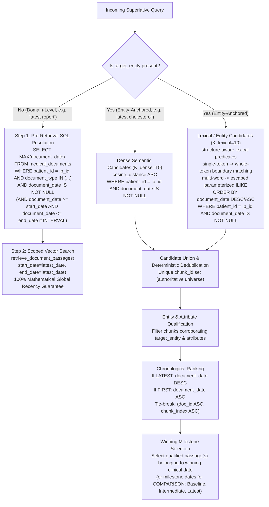
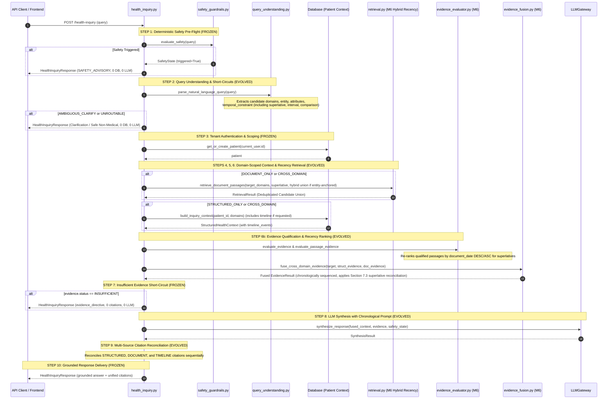

# Phase 2 — Milestone 6: Longitudinal Health Timeline & Recency-Ranked Retrieval
## Architecture Lock Specification

> **Milestone Theme**: *Empower personal health inquiry with chronological intelligence: deterministic superlative resolution, recency-ranked vector retrieval, longitudinal Health Timeline grounding, cross-time report comparison, and multi-source chronological citation reconciliation.*  
> **Status**: APPROVED ARCHITECTURE SPECIFICATION (READ-ONLY ARCHITECTURE LOCK)  
> **Milestone 1 State**: COMPLETE & LOCKED (2026-09-14)  
> **Milestone 2 State**: COMPLETE & LOCKED (2026-09-15)  
> **Milestone 3 State**: COMPLETE & LOCKED (2026-09-17, Commit `a5485b2`)  
> **Milestone 4 State**: COMPLETE & LOCKED (2026-09-21, Commit `f86fbfd`)  
> **Milestone 5 State**: COMPLETE & LOCKED (2026-09-24, Commit `5e306f8`)  
> **Baseline Commit**: `5e306f8` (`feat(phase-2-milestone-5): add deterministic evaluation harness`)  
> **Parent Authorities**:
> - [`docs/SPEC.md`](file:///d:/Personal%20Projects/Personal%20HealthCare/docs/SPEC.md)
> - [`docs/DESIGN.md`](file:///d:/Personal%20Projects/Personal%20HealthCare/docs/DESIGN.md)
> - [`docs/ROADMAP.md`](file:///d:/Personal%20Projects/Personal%20HealthCare/docs/ROADMAP.md)
> - [`phases/phase-02.md`](file:///d:/Personal%20Projects/Personal%20HealthCare/phases/phase-02.md)
> - [`phases/P2-M5-architecture-lock.md`](file:///d:/Personal%20Projects/Personal%20HealthCare/phases/P2-M5-architecture-lock.md)
> - [`phases/P2-M5-S5-architecture-lock.md`](file:///d:/Personal%20Projects/Personal%20HealthCare/phases/P2-M5-S5-architecture-lock.md)
> - [`phases/P2-M5-S6-architecture-lock.md`](file:///d:/Personal%20Projects/Personal%20HealthCare/phases/P2-M5-S6-architecture-lock.md)  
> **Implementation Mandate**: Architecture lock only. No implementation code, migrations, schemas, existing tests, or frontend files are modified in this step.

---

## 1. Milestone Purpose, Scope & Core Principles

### 1.1 Purpose
Milestones 1 through 5 delivered a robust, multi-domain, cross-fused health intelligence pipeline with deterministic safety guardrails and bounded ISO date interval filtering. However, the retrieval and grounding pipeline remains **temporally unordered and blind to recency**:
1. **Superlative Blindness**: Queries seeking the most recent or earliest facts (e.g., *"What is my latest cholesterol level?"*, *"What was my first blood pressure reading?"*) were deliberately deferred in M5 S5 and mapped to `TemporalScope.ALL` with zero chronological sorting guarantees.
2. **Vector Similarity Recency Inversion**: Vector similarity search in `retrieval.py` orders chunks strictly by cosine distance (`cosine_distance ASC`). An older report from 2022 with higher embedding similarity routinely outranks and eclipses an authoritative 2025 report.
3. **Timeline Event Disconnection**: Phase 1 established a unified Health Timeline projection (`backend/app/health/timeline.py`), but timeline events are excluded from `inquiry.py` structured domains, bypassed by domain-scoped context assembly, unexamined by evidence evaluation, and cannot be cited.
4. **Cross-Time Progression & Comparison Deficit**: When multiple clinical records or document passages provide different values across time (e.g., 2023 vs. 2025 lab panels, or medication titration from 10mg to 20mg), M5 treats them as static evidence coexistence without providing structured chronological progression.

**Milestone 6 eliminates these deficiencies.** It establishes the **Longitudinal Grounding and Recency-Ranked Retrieval Engine**, enabling the system to understand *when* events occurred, *which* is the latest or earliest, *how* records progressed over time, and *how* the patient's chronological timeline grounds the answer.

### 1.2 Core Architectural Principles
1. **Deterministic Chronology Over Model Assumption**:
   The LLM must never be relied upon to deduce which document is newer or to order raw dates. The backend deterministic engine extracts temporal ordering intent, pre-filters/re-ranks retrieval candidates, verifies chronological bounds, and structures evidence in explicit chronological sequence before synthesis.
2. **Clinical Date Fidelity**:
   Clinical recency is governed strictly by verifiable clinical event dates (`MedicalDocument.document_date`, `Condition.started_at`, `Medication.started_at`, `HealthEvent.event_date`). Fallbacks to `created_at` or `uploaded_at` as clinical dates remain **strictly prohibited**. Timeline events with `event_type == "DOCUMENT_UPLOADED"` represent file upload timestamps and are strictly disqualified from satisfying clinical recency or comparison claims.
3. **Entity-Corroborated Recency**:
   For entity-specific queries (e.g., *"What is my latest cholesterol?"*), "latest" means the latest verified record *that corroborates the entity*, NOT merely the newest document in the archive (which might be an unrelated imaging study or CBC lacking cholesterol).
4. **Zero Silent Supersession**:
   When newer evidence exists, the backend provides chronological progression rather than silently erasing historical records. Both records are cited with their respective dates.

---

## 2. Non-Goals & Deliberate Future Architectural Directions

### 2.1 Out-of-Scope Capabilities for Milestone 6
To preserve velocity and scope discipline (per `AGENTS.md`), the following remain strictly **OUT OF SCOPE** for Milestone 6:

1. **NO Multi-Turn Conversational Memory & Dialogue Sessions** (*Deferred to Milestone 7*):
   The API remains strictly single-turn stateless request/response (`POST /health-inquiry`). No session tracking, chat conversation threading, or context compression.
2. **NO Proactive Monitoring or Unsolicited Trend Alerts** (*Phase 3*):
   The system does not monitor the database in the background or emit unprompted notifications when a new report is uploaded.
3. **NO Autonomous Clinical Triage, Diagnosis, or Treatment Advice** (*Phase 5 / Forbidden by SPEC.md*):
   The system explains documented history, trends, and reported changes. It never diagnoses, calculates clinical risk scores, or advises changing medication regimens.
4. **NO External EHR / ABDM / FHIR Integrations** (*Phase 4/5*):
   Retrieval operates solely on the authenticated user's personal health workspace data.
5. **NO Wearables & Continuous IoT Streaming** (*Phase 3*).
6. **NO Optical Character Recognition (OCR) for Scanned Handwriting or Images** (*Deferred*).
7. **NO External Dedicated Vector DB SaaS (Pinecone, Weaviate, Qdrant)**:
   PostgreSQL + `pgvector` remains the sole vector database.
8. **NO Autonomous ReAct Agents or LLM Tool-Calling Loops**:
   All routing, candidate selection, ranking, and qualification logic remains 100% deterministic code.
9. **NO Open-Ended Causal Reasoning** (e.g., *"Why did my doctor change my medication?"* requiring speculative medical reasoning).

### 2.2 Deliberate Future Architectural Directions (Explicit Deferrals)
The following capabilities represent deliberate future architectural directions rather than silently omitted concerns. They are explicitly acknowledged, bounded, and deferred from Milestone 6:

1. **Structured Clinical Value Extraction at Document Ingestion**:
   - *Future Direction*: Parsing documents during ingestion into structured clinical tuples (e.g. `(analyte, numeric_value, unit, reference_range, clinical_date)`) stored in a dedicated relational or semi-structured laboratory store.
   - *M6 Boundary*: In M6, document evidence is retrieved from raw passages (`DocumentChunk`) and evaluated via post-retrieval regex/corroboration. Ingestion pipelines and schemas remain untouched.
2. **General Hybrid Dense + Lexical Retrieval for All Health Inquiries**:
   - *Future Direction*: A universal hybrid sparse/dense retrieval architecture across the entire inquiry surface (incorporating BM25, SPLADE, or reciprocal rank fusion for general topical queries).
   - *M6 Boundary*: M6 introduces a deterministic lexical recall path *strictly* for entity-anchored longitudinal/superlative candidate retrieval to overcome vector recency blindness. General queries continue using M5 retrieval contracts.
3. **Full Numeric Time-Series & Trend Analytics**:
   - *Future Direction*: Statistical time-series processing, regression slopes, moving averages, min/max analyte discovery over arbitrary time windows, and graphical longitudinal charts.
   - *M6 Boundary*: M6 provides a bounded chronological trajectory summary ($N \le 3$ milestone points: Baseline, Intermediate, Latest). It explicitly excludes statistical time-series computation.
4. **Claim-Level Semantic Entailment & Fine-Grained Citation Verification**:
   - *Future Direction*: Post-generation NLI (Natural Language Inference) models or automated claim-level entailment verifiers auditing every individual synthesized sentence against cited spans.
   - *M6 Boundary*: M6 maintains server-side citation reconciliation, token deduplication, and deterministic structured/passage citation tracking without introducing heavy auxiliary NLI inference models.
5. **Adaptive Retrieval Expansion Beyond Deterministic Candidate Strategy**:
   - *Future Direction*: Dynamic iterative retrieval loops that adaptively expand the candidate window or relax thresholds when evidence is borderline.
   - *M6 Boundary*: M6 uses a strictly bounded, single-pass, deterministic candidate strategy ($K_{\text{dense}} = 10$, $K_{\text{lexical}} = 10$). Adaptive tool loops remain excluded.

---

## 3. Superlative Contract

### 3.1 Supported Superlatives & Exact Canonical Taxonomy
Milestone 6 introduces typed superlative extraction into `TemporalConstraint`.

```python
class SuperlativeType(str, Enum):
    """Canonical chronological extremity requested by user inquiry."""
    LATEST = "latest"  # Most recent, newest, current documented state
    FIRST = "first"    # Earliest, oldest, initial documented state
```

#### Canonical Aliases Table:
| Surface Phrasing Tokens | Canonical `SuperlativeType` | Architectural Semantics |
| :--- | :--- | :--- |
| `"latest"`, `"newest"`, `"most recent"`, `"last"`, `"recent"` (with superlative syntax, e.g. `"most recent"`) | `SuperlativeType.LATEST` | Target the newest clinically dated record/passage corroborating the inquiry. |
| `"first"`, `"earliest"`, `"oldest"`, `"initial"` | `SuperlativeType.FIRST` | Target the oldest clinically dated record/passage corroborating the inquiry. |

### 3.2 Exact Parser Output & Schema Evolution
`SuperlativeType` belongs directly inside `TemporalConstraint` in `backend/app/schemas/inquiry.py`:

```python
class TemporalConstraint(BaseModel):
    """Detailed temporal boundaries extracted from the natural language query."""
    scope: TemporalScope = TemporalScope.ALL
    start_date: Optional[date] = None
    end_date: Optional[date] = None
    anchor_year: Optional[int] = None
    raw_expression: Optional[str] = None
    superlative: Optional[SuperlativeType] = None  # NEW in M6
```

### 3.3 Composition with Existing `TemporalScope` & Explicit M5 $\rightarrow$ M6 Semantic Upgrade
Superlatives compose orthogonally with `TemporalScope`:

1. **Superlative Universal Baseline Default (`scope = TemporalScope.ALL`)**:
   - For unbounded superlative queries (e.g., `"What is my latest cholesterol?"`, `"What was my first medication?"`, `"What was my first diagnosed condition?"`):
     - `scope = TemporalScope.ALL`
     - `start_date = None`, `end_date = None`
     - `superlative = SuperlativeType.LATEST` or `SuperlativeType.FIRST`
     - *Semantics*: Chronological extremity evaluates across the patient's entire longitudinal history (both active and resolved states).
     - **Explicit M5 $\rightarrow$ M6 Semantic Upgrade**: In M5 S1, queries matching the token `"diagnosed"` were hardcoded to `TemporalScope.HISTORICAL` (which filtered out active conditions). In M6, when a superlative modifier (`"first"`, `"earliest"`, `"latest"`) is present, the parser upgrades the scope deterministically to `TemporalScope.ALL`. This guarantees active chronic conditions diagnosed in the past (e.g. Asthma diagnosed in 2020 and still active) are not falsely suppressed from `"first condition"` queries.
2. **Interval-Bounded Superlative (`scope = TemporalScope.INTERVAL`)**:
   - For range-constrained superlatives (e.g., `"What was my latest blood pressure in 2024?"`):
     - `scope = TemporalScope.INTERVAL`
     - `start_date = date(2024, 1, 1)`, `end_date = date(2024, 12, 31)`
     - `anchor_year = 2024`
     - `superlative = SuperlativeType.LATEST`
     - *Semantics*: Filter records strictly within the interval; select the newest corroborating evidence within that window.
3. **Explicitly Constrained Active State Superlative (`scope = TemporalScope.CURRENT`)**:
   - Reserved strictly for queries explicitly requesting active/current records (e.g., `"What is my latest active prescription?"`, `"What is my newest current medication?"`):
     - `scope = TemporalScope.CURRENT`
     - `superlative = SuperlativeType.LATEST`
     - *Semantics*: Filter for active records; select the newest among active entries.
4. **Explicitly Constrained Historical State Superlative (`scope = TemporalScope.HISTORICAL`)**:
   - Reserved strictly for queries explicitly requesting past/inactive/discontinued records (e.g., `"What was my first discontinued medication?"`, `"What was my earliest resolved condition?"`):
     - `scope = TemporalScope.HISTORICAL`
     - `superlative = SuperlativeType.FIRST`
     - *Semantics*: Filter for inactive/resolved records; select the earliest among resolved entries.

### 3.4 Behavior Under Boundary Conditions
1. **No Clinically Dated Evidence Exists**:
   - If records matching the entity exist, but NONE possess a verifiable clinical date:
     - `EvidenceStatus.PARTIALLY_SUFFICIENT`
     - Directive: `"Records for [entity] were found, but lack documented clinical dates to verify which is the [latest/first]."`
     - Records are cited, but the system explicitly refuses to assert chronological certainty.
2. **Undated Records**:
   - A record is undated when its domain-defined verifiable clinical date is absent (`document_date` for document evidence; the applicable domain-defined clinical date such as `started_at` or `event_date` for structured/timeline evidence).
   - Undated records are strictly **ineligible** to win a superlative claim over dated records.
   - If ALL matching records are undated, return `PARTIALLY_SUFFICIENT` with the date-absence honesty directive.
   - `uploaded_at`, `created_at`, and other administrative/recording timestamps are **strictly prohibited** as fallbacks for clinical recency.
   - Timeline events with `event_type == "DOCUMENT_UPLOADED"` remain strictly disqualified from clinical recency.
3. **Same-Date Ties**:
   - When two or more records/passages share the exact same clinical date:
     - For Document Passages: Tie-break deterministically via `(document_date DESC/ASC, document_id ASC, chunk_index ASC)`.
     - For Structured Records: Tie-break deterministically via `(event_date DESC/ASC, record_id ASC)`.
     - Both tied records are retained in the evidence set and cited. The synthesis prompt explicitly instructs: *"Both records were documented on [Date]; present both without asserting one preceded the other."*
4. **Unsupported / Vague Subjective Temporal Language**:
   - Phrases like `"recently"`, `"lately"`, `"a while ago"` lacking a measurable time unit (days, months, years) or superlative anchor:
     - If anchorless (`"How am I doing lately?"`): `routing_mode = AMBIGUOUS_CLARIFY`, `clarification_required = True`.
     - If anchored (`"What was my blood pressure recently?"`): Maps conservatively to `TemporalScope.ALL`, `superlative = SuperlativeType.LATEST`.

---

## 4. Timeline Domain Contract

### 4.1 First-Class Structured Domain vs. Longitudinal Projection
**Authoritative Architectural Resolution**:
- In the **Query Understanding & Routing Layer**: `timeline` becomes a **first-class structured domain** in `STRUCTURED_DOMAINS` (`{"conditions", "medications", "allergies", "symptoms", "goals", "profile", "timeline"}`). Queries targeting events, consultations, appointments, or chronological logs map to `candidate_structured_domains = ["timeline"]`.
- In the **Storage & Data Layer**: `timeline` remains a **deterministic longitudinal projection**. It does not create a redundant relational table. Instead, `build_inquiry_context()` invokes `get_timeline(db, patient_id)` (`backend/app/health/timeline.py`) to synthesize `StructuredHealthContext.recent_timeline_events`.

### 4.2 Data Shape & Context Integration
`StructuredHealthContext` in `backend/app/health/inquiry_context.py` already includes `recent_timeline_events: list[HealthEvent]`.
M6 unlocks this field:
```python
# In backend/app/health/inquiry_context.py:
if domains is None or "timeline" in domains:
    timeline_events = await get_timeline(db, patient_id)
```
Each `HealthEvent` provides:
- `event_date: str` (Canonical ISO date `YYYY-MM-DD` or UTC timestamp `YYYY-MM-DDTHH:MM:SSZ`)
- `event_type: str` (`CONDITION_STARTED`, `CONDITION_RESOLVED`, `SYMPTOM_RECORDED`, `MEDICATION_STARTED`, `MEDICATION_STOPPED`, `DOCUMENT_DATED`, `DOCUMENT_UPLOADED`, `GOAL_RECORDED`)
- `event_state: Literal["current", "historical", "neutral"]`
- `title: str`
- `description: Optional[str]`
- `source_type: Literal["CONDITION", "SYMPTOM", "MEDICATION", "DOCUMENT", "GOAL"]`
- `source_id: uuid.UUID` (Authoritative foreign key of originating source record)

**Clinical Date Invariant for Timeline Events**:
Events with `event_type == "DOCUMENT_UPLOADED"` are synthesized from `uploaded_at` when a document lacks a clinical date. In M6, `DOCUMENT_UPLOADED` events represent administrative file ingestion metadata and are **strictly disqualified from satisfying clinical LATEST, FIRST, or COMPARISON queries**.

### 4.3 Supported Query Intents & Semantic Mapping
| User Query | Candidate Structured | Candidate Document | Routing Mode | Target Entity |
| :--- | :--- | :--- | :--- | :--- |
| `"Show my health timeline"` | `["timeline"]` | `[]` | `STRUCTURED_ONLY` | `None` |
| `"What events happened in 2024?"` | `["timeline"]` | `["reports", "labs", "clinical_documents"]` | `CROSS_DOMAIN` | `None` |
| `"When was my doctor consultation?"` | `["timeline"]` | `["clinical_documents", "reports"]` | `CROSS_DOMAIN` | `"consultation"` |
| `"What was my timeline for Asthma?"` | `["timeline", "conditions"]` | `["clinical_documents"]` | `CROSS_DOMAIN` | `"Asthma"` |

### 4.4 Timeline Evidence Participation in Sufficiency & Fusion
Timeline evidence evaluation in `evaluate_timeline_evidence()` is aligned 100% with the **M5 7-case truth table**:

1. **Entity Matching**: Checks `HealthEvent.title` and `HealthEvent.description` case-insensitively for `target.target_entity`.
2. **Attribute Verification**: Checks `HealthEvent.description` for `target.requested_attributes` (e.g. dosage, frequency, notes). Attributes matched in description are added to `matched_fields`; missing attributes are recorded in `missing_fields`.
3. **Temporal Filtering**:
   - Under `INTERVAL`: `start_date <= event_date <= end_date`.
   - Under `CURRENT`: `event_state == "current"`.
   - Under `HISTORICAL`: `event_state == "historical"`.
   - Under `superlative == LATEST`: Filters out `DOCUMENT_UPLOADED`, then sorts matching events by `event_date DESC`.
   - Under `superlative == FIRST`: Filters out `DOCUMENT_UPLOADED`, then sorts matching events by `event_date ASC`.
4. **Sufficiency Classification (Aligned with M5 Rules)**:
   - **Entity Present + All Requested Attributes Present**: `EvidenceStatus.SUFFICIENT`.
   - **Entity Present + Some Requested Attributes Missing**: `EvidenceStatus.PARTIALLY_SUFFICIENT` with directive:
     `f"{target.target_entity} is recorded on your timeline, but not found: {human_missing_str}."`
   - **Entity Present + All Requested Attributes Missing**: `EvidenceStatus.PARTIALLY_SUFFICIENT`.
   - **Entity Absent Everywhere**: `EvidenceStatus.INSUFFICIENT` with directive:
     `"No timeline events were recorded matching: [entity]."`
   - **Attribute-Only Queries (No Entity)**:
     - All attributes matched: `SUFFICIENT`.
     - Some attributes matched: `PARTIALLY_SUFFICIENT`.
     - No attributes matched: `INSUFFICIENT`.
   - **Generic Timeline Queries (No Entity, No Attributes, e.g. "Show my timeline")**:
     - At least 1 event in requested interval: `SUFFICIENT`.
     - 0 events in requested interval: `INSUFFICIENT` with directive:
       `"No timeline events were recorded for this period."`
5. **Cross-Domain Fusion**:
   In `evidence_fusion.py`, timeline evidence is treated as structured evidence. Matched timeline events fuse directly into `matched_records`. Cross-domain superlative inquiries reconciling structured/timeline events with document passages follow the authoritative reconciliation rules defined in **Section 7.3**.

---

## 5. Recency Retrieval Contract (Resolving Vector Blindness)

### 5.1 The Technical Dilemma & Explicit Contract Definition
In pgvector semantic search, ordering by `cosine_distance ASC LIMIT K` cannot mathematically guarantee retrieving the globally newest document if a patient has many documents discussing an analyte. Conversely, ordering purely by `document_date DESC LIMIT K` misses relevant documents entirely if the newest documents are unrelated studies (e.g. a 2026 CBC when looking for cholesterol).

M6 resolves this dilemma by establishing an explicit, mathematically sound, two-part retrieval contract:

```text
┌────────────────────────────────────────────────────────────────────────────────────────┐
│                        M6 SUPERLATIVE RETRIEVAL STRATEGY MATRIX                        │
├───────────────────────────────┬────────────────────────────────────────────────────────┤
│ Query Class                   │ Authoritative Retrieval Strategy & Contract Guarantee  │
├───────────────────────────────┼────────────────────────────────────────────────────────┤
│ 1. Domain-Level Superlative   │ Strict Global Deterministic Recency Guarantee          │
│    (target_entity is None)    │ Pre-retrieval SQL dynamically scopes vector search to  │
│    e.g. "latest report"       │ documents matching MAX(document_date). (100% global)   │
├───────────────────────────────┼────────────────────────────────────────────────────────┤
│ 2. Entity-Anchored Superlative│ Deterministic Hybrid Candidate Recall Union            │
│    (target_entity is not None)│ (Dense Semantic + Lexical Entity) with Strict Recency  │
│    e.g. "latest cholesterol" │ Authoritative candidate universe is the deterministic  │
│                               │ union of dense candidates (K_dense=10) and lexical     │
│                               │ entity candidates (K_lexical=10), deduplicated,        │
│                               │ qualified, and strictly ordered chronologically.       │
└───────────────────────────────┴────────────────────────────────────────────────────────┘
```

### 5.2 Exact Algorithm Specification



#### 1. Domain-Level Superlative Algorithm (`target_entity is None`):
1. **Pre-Retrieval Date Discovery**:
   The engine executes a fast SQL aggregation over the patient's medical documents:
   - **Unbounded Superlatives (`scope == TemporalScope.ALL`, e.g. *"What is my latest lab report?"*)**:
     ```sql
     SELECT MAX(document_date) AS target_date
     FROM medical_documents
     WHERE patient_id = :patient_id
       AND document_type IN (:target_document_types)
       AND document_date IS NOT NULL;
     ```
     *(For `FIRST`, executes `MIN(document_date)`)*.
   - **Interval-Bounded Superlatives (`scope == TemporalScope.INTERVAL`, e.g. *"What was my latest lab report in 2024?"*)**:
     The engine explicitly requires that `MAX(document_date)` / `MIN(document_date)` is computed within the existing `TemporalConstraint` interval when `scope == INTERVAL`:
     ```sql
     SELECT MAX(document_date) AS target_date
     FROM medical_documents
     WHERE patient_id = :patient_id
       AND document_type IN (:target_document_types)
       AND document_date IS NOT NULL
       AND document_date >= :start_date
       AND document_date <= :end_date;
     ```
     *(For `FIRST`, executes `MIN(document_date)` with the same interval predicates)*.  
     **Example**: For `"What was my latest lab report in 2024?"` (`start_date = 2024-01-01`, `end_date = 2024-12-31`), the extremity is resolved strictly among records where:
     ```text
     document_date IS NOT NULL
     AND document_date >= start_date
     AND document_date <= end_date
     ```
2. **Scoped Vector Retrieval**:
   If `target_date` is found, injects `start_date = target_date`, `end_date = target_date` into `retrieve_document_passages()`. If no record matches the interval or filters, vector retrieval is bypassed and evidence evaluation yields `EvidenceStatus.INSUFFICIENT`.
3. **Guarantee**: **100% Strict Deterministic Recency Guarantee**. Retrieved chunks originate strictly from the patient's newest (or oldest) document in that domain (either globally across all time or within the designated interval).

#### 2. Entity-Anchored Superlative Algorithm (`target_entity is not None`):
Rather than relying on dense vector recall alone, the authoritative candidate universe for entity-anchored superlatives is formed by a **Deterministic Hybrid Candidate Recall Union (Dense + Lexical)**:

```text
    dense semantic candidates (K_dense = 10)
                      +
    lexical/entity candidates (K_lexical = 10)
                      ↓
              candidate union
                      ↓
       entity/attribute qualification
                      ↓
            chronological ranking
                      ↓
              winning milestone
```

1. **Dual Candidate Retrieval Paths**:
   - **Path A: Dense Semantic Recall ($K_{\text{dense}} = 10$)**:
     In `retrieval.py`, executes pgvector cosine similarity search over `DocumentChunk.embedding`.
     - Constraints: `DocumentChunk.patient_id == patient_id`, `MedicalDocument.patient_id == patient_id`, `MedicalDocument.document_type IN (:target_document_types)`, and `MedicalDocument.document_date.is_not(None)`.
     - Captures semantically related passages that may refer to the entity through clinical synonyms or broader test panels (e.g. lipid panel for cholesterol).
   - **Path B: Deterministic Lexical / Entity Recall ($K_{\text{lexical}} = 10$)**:
     In `retrieval.py`, executes a direct SQL query over existing document chunks using a **curated narrow lexical variant map** and **deterministic ILIKE escaping**:

     **a. Narrow Lexical Variant Map Contract**:
     The lexical recall path must search genuine lexical variants and standard clinical abbreviations for the target entity without conflating distinct clinical concepts:
     - **Clinical Separation Invariant**: Related clinical concepts are **never** treated as synonyms:
       - `cholesterol != LDL`
       - `cholesterol != lipid panel`
       - `blood pressure != systolic`
       - `blood pressure != diastolic`
     - **Curated In-Memory Map**: Defined as a small, deterministic in-memory mapping in code (e.g. `retrieval.py` / `query_understanding.py`) without database tables or external dependencies:
       ```python
       LEXICAL_VARIANT_MAP: dict[str, list[str]] = {
           "cholesterol": ["cholesterol", "total cholesterol", "chol"],
           "blood pressure": ["blood pressure", "bp"],
       }
       ```
     - **Scope Boundary**: The map is strictly M6 retrieval-only (expanding candidate recall); it is **NOT** a general clinical ontology, does not alter M5 routing, and does not override downstream entity/attribute qualification. If an entity is not in `LEXICAL_VARIANT_MAP`, the variant set defaults to `[target.target_entity]`.
     - **Lexical Recall Guarantee Scope**: Deterministic lexical recall is guaranteed only for explicitly curated lexical variants under their declared matching semantics. Clinically or morphologically related compound terms are not covered by the lexical recall guarantee unless they are explicitly added as curated variants. Dense retrieval may recover such related expressions, but the lexical path must not infer semantic equivalence through unrestricted substring matching. This is strictly a retrieval-scope statement governing candidate expansion, not a change to M5 routing or downstream evidence qualification.

     **b. Deterministic Parameterized Matching by Variant Structure & Literal Escaping**:
     Candidate retrieval selects the SQL matching predicate strictly according to variant **STRUCTURE**:
     - **Single-Token Lexical Variants** (e.g. `"bp"`, `"chol"`, `"cholesterol"`, or single-word fallback `target.target_entity`):
       - **Mandatory Literal Escaping**: Before constructing the whole-token regex predicate, the token MUST be encoded as a literal for the target PostgreSQL ARE regular-expression predicate; implementation MUST escape all PostgreSQL regex metacharacters before constructing the boundary predicate.
       - The escaped literal is then wrapped in PostgreSQL's native word-boundary semantics: `\m <escaped-literal> \M` (e.g., `c.chunk_text ~* :token_boundary_pattern_0`).
       - Matching remains strictly case-insensitive and deterministic.
       - This literal-escaping requirement applies both to curated variants in `LEXICAL_VARIANT_MAP` and the fallback `[target.target_entity]` lexical token when that token is single-word.
       - Do not introduce a regex ontology, stemming, fuzzy matching, or external dependency.
     - **Multi-Word Lexical / Phrase Variants** (e.g. `"blood pressure"`, `"total cholesterol"`):
       - Evaluated using deterministic escaped parameterized phrase matching.
       - To guarantee safe, literal string matching and prevent wildcard injection for multi-word phrases (e.g., entities containing `%`, `_`, or the escape character), the engine strictly escapes metacharacters before SQL query construction:
         ```python
         def escape_ilike_literal(text: str, escape_char: str = "!") -> str:
             """Escape PostgreSQL ILIKE wildcard metacharacters for literal matching."""
             return (
                 text.replace(escape_char, escape_char + escape_char)
                     .replace("%", escape_char + "%")
                     .replace("_", escape_char + "_")
             )
         ```
         Each multi-word phrase variant $v$ is escaped and wrapped as `f"%{escape_ilike_literal(v)}%"`.

     **c. SQL Lexical Candidate Query (Structure-Aware Predicates)**:
     Candidate retrieval dynamically selects predicates according to variant structure, executing with an explicit `ESCAPE '!'` clause for multi-word phrases:
     ```sql
     SELECT c.id, c.document_id, c.chunk_index, c.chunk_text, d.document_date, d.document_type
     FROM document_chunks c
     JOIN medical_documents d ON c.document_id = d.id AND c.patient_id = d.patient_id
     WHERE c.patient_id = :patient_id
       AND d.document_type IN (:target_document_types)
       AND d.document_date IS NOT NULL
       AND (
           -- Single-token variant: deterministic whole-token boundary predicate with escaped literal
           c.chunk_text ~* :token_boundary_pattern_0
           -- Multi-word phrase variant: deterministic escaped parameterized phrase predicate
           OR c.chunk_text ILIKE :phrase_pattern_1 ESCAPE '!'
           -- ... dynamically selected per variant structure in the curated variant set
       )
     ORDER BY d.document_date DESC -- (or ASC if superlative == FIRST)
     LIMIT :k_lexical;
     ```
     - **Zero-Migration Invariant**: Operates entirely over existing `document_chunks` and `medical_documents` tables. Requires **zero schema migrations**.
     - **Index Independence**: GIN, `pg_trgm`, or `tsvector` indexes are **strictly non-functional performance optimizations deferred to future scale**; they are NOT a mandatory M6 functional dependency.
     - **Tenant & Date Invariants**: Preserves strict `patient_id` tenant isolation and `document_date IS NOT NULL`.

     **d. Token-Structure Lexical Precision Contract (Structural Matching)**:
     Lexical variant matching is determined strictly by variant **STRUCTURE** rather than arbitrary length thresholds:
     - **Structural Categories**:
       - **Single-token lexical variant** $\rightarrow$ deterministic whole-token boundary matching with mandatory regex literal escaping.
       - **Multi-word lexical/phrase variant** $\rightarrow$ deterministic escaped parameterized phrase matching.
       - `"bp"` remains supported as a single-token lexical variant.
       - `"chol"` remains supported as a single-token lexical variant.
       - `"blood pressure"`, `"cholesterol"`, and `"total cholesterol"` remain supported.
     - **Whole-Token Boundary Matching Definition & Literal Escaping**:
       - **Literal Escaping Pre-Condition**: The token MUST be encoded as a literal for the target PostgreSQL ARE regular-expression predicate; implementation MUST escape all PostgreSQL regex metacharacters before constructing the boundary predicate. The escaped literal is then wrapped in PostgreSQL's native word-boundary semantics: `\m <escaped-literal> \M`.
       - Matching remains case-insensitive and deterministic across all single-token evaluations (curated variants and single-word fallback `[target.target_entity]`).
       - Token boundaries follow PostgreSQL word-boundary semantics: a word character is a letter, digit, or underscore; `\m` marks the beginning of a word and `\M` marks the end:
         - Standalone matches: `"BP: 120/80"`, `"BP 130/85"`, `"(BP)"`, and string-edge occurrences match `"bp"`.
         - Non-matches: `"RBP"` does **NOT** match `"bp"`.
         - Standalone matches: `"chol: 180"`, `"Total Chol 200"`, `"(chol)"`, and string-edge occurrences match `"chol"`.
         - Non-matches: `"cholecystectomy"`, `"cholecystitis"`, `"cholelithiasis"`, `"cholangitis"`, and `"cholera"` do **NOT** match `"chol"` merely because they contain the same character sequence.
     - **Architectural Rationale**: This prevents unrelated token substrings from consuming entries in the bounded $K_{\text{lexical}}=10$ candidate recall path as well as preventing false evidence qualification.
     - **Preserved Variant Map & Scope**: This is strictly a retrieval precision rule, not a clinical ontology. Keep the existing escaped literal matching contract for multi-word phrases. Do NOT introduce a generalized clinical ontology, stemming, fuzzy matching, or external package.
     - **Consistent Qualification Semantics**: Downstream entity and attribute qualification in `evidence_evaluator.py` (`evaluate_passage_evidence`) uses the SAME structural lexical matching semantics:
       - single-token variants $\rightarrow$ whole-token matching (with literal regex escaping)
       - multi-word variants $\rightarrow$ deterministic phrase matching
       An unrelated passage such as `"RBP"` or `"cholecystectomy"` must not qualify as evidence merely because it contains a lexical substring.

2. **Deterministic Candidate Union & Deduplication**:
   - The engine merges candidates from both paths into the authoritative candidate universe:
     $$\mathcal{U} = \mathcal{C}_{\text{dense}} \cup \mathcal{C}_{\text{lexical}}$$
   - Candidate bounds: $K_{\text{dense}} = 10, K_{\text{lexical}} = 10$. The candidate union satisfies $|\mathcal{U}| \le 20$ prior to deduplication.
   - Deduplication is deterministic, keyed uniquely by canonical `DocumentChunk.id` (or `(document_id, chunk_index)`).
   - If a chunk is retrieved by both dense and lexical paths, it is retained exactly once.

3. **Entity & Attribute Qualification (Pre-Ranking Gate)**:
   - In `evidence_evaluator.py` (`evaluate_passage_evidence`), qualification occurs **strictly before chronological winner selection**:
   - Every candidate in the union $\mathcal{U}$ is evaluated against `target.target_entity` and `target.requested_attributes`.
   - Chunks that do not corroborate the target entity or attributes are filtered out of the qualified subset $\mathcal{Q}$.
   - **Consistent Structural Qualification**: Qualification enforces the identical structural lexical matching semantics as retrieval: single-token variants use deterministic whole-token boundary matching, and multi-word variants use deterministic phrase matching. An unrelated passage such as `"RBP"` or `"cholecystectomy"` must not qualify as evidence merely because it contains a lexical substring.

4. **Strict Chronological Ranking**:
   - The *qualified subset* $\mathcal{Q}$ is sorted deterministically:
     - If `superlative == LATEST`: `p.document_date DESC`.
     - If `superlative == FIRST`: `p.document_date ASC`.
     - **Deterministic Secondary Tie-Break**: `(p.document_id ASC, p.chunk_index ASC)`.

5. **Winning Milestone Selection**:
   - Selects qualified passage(s) belonging to the winning clinical date (or milestone dates for COMPARISON: Baseline, Intermediate when applicable, Latest).

6. **Contract Scope & Architectural Honesty**:
   - The contract does NOT make an unsubstantiated claim of an unconstrained global guarantee over an arbitrarily large corpus.
   - It is explicitly defined as **Deterministic Hybrid Candidate Recall Union with Strict Chronological Re-Ranking**. By combining dense semantic search ($K_{\text{dense}}=10$) with date-ordered lexical entity matching ($K_{\text{lexical}}=10$), the architecture mitigates dense-vector recency blindness within the bounded candidate-recall contract and guarantees that the newest/oldest lexically matched passages enter the candidate universe for qualification and ranking.

---

## 6. Evidence, Provenance & Stable Citation Identity Contract

### 6.1 The Non-Unique `source_id` Problem
In Phase 1, `get_timeline()` generates timeline events dynamically:
- A single `Condition` (with UUID `c.id`) produces **two distinct events**:
  1. `CONDITION_STARTED` (`source_id = c.id`)
  2. `CONDITION_RESOLVED` (`source_id = c.id`)
- A single `Medication` (with UUID `m.id`) produces **two distinct events**:
  1. `MEDICATION_STARTED` (`source_id = m.id`)
  2. `MEDICATION_STOPPED` (`source_id = m.id`)

If citations are keyed by `source_id`, the second event overwrites the first in `_build_record_map()`, and citation deduplication (`seen_structured_ids`) drops one of the events.

### 6.2 Authoritative Resolution: Deterministic UUID5 Timeline Identity
M6 defines a **deterministic, collision-free, stable UUID5** for every timeline event:

```python
import uuid

def generate_timeline_event_id(
    source_type: str,
    source_id: uuid.UUID,
    event_type: str,
) -> uuid.UUID:
    """Generate stable, unique, deterministic UUID for a timeline event projection."""
    identity_str = f"timeline:{source_type}:{source_id}:{event_type}"
    return uuid.uuid5(uuid.NAMESPACE_URL, identity_str)
```

### 6.3 Exact Citation & Record Map Semantics
1. **`_build_record_map(context)` Implementation**:
   ```python
   for event in context.recent_timeline_events:
       event_id = generate_timeline_event_id(
           event.source_type, event.source_id, event.event_type
       )
       event_title = event.event_type.replace("_", " ").title()
       label = f"{event.title} ({event_title}) - {event.event_date}"
       record_map[event_id] = (
           "TIMELINE",
           label,
           VerificationState.SOURCE_RECORDED,
       )
   ```
2. **Citation Emission**:
   Canonical `InquiryCitation` emits `record_id = event_id`. Because `event_id` is a valid RFC-4122 UUID, the existing `InquiryCitation` schema in `app/schemas/inquiry.py` requires zero modifications.
3. **Deduplication Invariant**:
   In `health_inquiry.py`, citation deduplication tracks:
   - `seen_tokens: set[str]` for passage citations (`[DOC-k]`).
   - `seen_structured_ids: set[uuid.UUID]` for structured relational records.
   - `seen_timeline_ids: set[uuid.UUID]` for timeline event UUIDs.
   This guarantees that `CONDITION_STARTED` and `CONDITION_RESOLVED` from the same underlying condition are distinct, unique, stable, and can both be cited simultaneously without collision or data loss.

---

## 7. Cross-Time Comparison & Progression Contract

### 7.1 The Deterministic Longitudinal Trajectory Policy
When `question_intent == "COMPARISON"` (e.g., `"compare"`, `"how has [entity] changed"`, `"difference between"`, `"trend"`, `"progression"`, `"over time"`):

The backend enforces the **Deterministic Longitudinal Trajectory Policy**:
1. **Milestone Date Selection ($N \le 3$)**:
   The engine selects distinct clinically dated records/passages, bounded to at most $N=3$ chronological milestone points:
   - **Baseline Point**: Earliest qualified clinically dated record (`FIRST`).
   - **Latest Point**: Most recent qualified clinically dated record (`LATEST`).
   - **Intermediate Point**: If $\ge 3$ distinct qualified clinically dated records/passages exist, the most recent intermediate record between Baseline and Latest.
2. **Defensive Date-Count Threshold**:
   - If $\ge 2$ distinct clinical dates exist: Returns `EvidenceStatus.SUFFICIENT` (or `PARTIALLY_SUFFICIENT` if attributes missing). Structures evidence chronologically: `[Baseline (Date 1), Intermediate (Date 2), Latest (Date 3)]`.
   - If exactly 1 distinct clinical date exists: Cannot compare! Returns `EvidenceStatus.PARTIALLY_SUFFICIENT` with directive:
     `"Only a single record on [Date] was found; at least two recorded dates are required to compare changes over time."`
   - If 0 distinct clinical dates exist: `EvidenceStatus.INSUFFICIENT` with directive:
     `"No clinically dated records were found to compare changes over time."`
3. **Retrieval Selection Consistency**:
   The Deterministic Longitudinal Trajectory Policy permits:
   **Baseline + Intermediate + Latest ($N \le 3$)**.  
   Therefore, the retrieval contract ensures comparison retrieval preserves **all selected milestone dates**:
   - **Baseline Date**: Earliest distinct qualified clinical date (`FIRST`).
   - **Intermediate Date (when applicable)**: The most recent intermediate distinct qualified clinical date (when $\ge 3$ distinct qualified clinically dated records/passages exist).
   - **Latest Date**: Most recent distinct qualified clinical date (`LATEST`).

   **Passage Allocation Budget ($K \le 4$ passages total)**:
   - Retrieval strictly preserves all selected milestone dates—Baseline, Intermediate when applicable, and Latest. The contract does NOT restrict retrieval to only "Baseline and Latest".
   - Candidate union $\mathcal{U} = \mathcal{C}_{\text{dense}} \cup \mathcal{C}_{\text{lexical}}$ (with $K_{\text{dense}} = 10, K_{\text{lexical}} = 10, |\mathcal{U}| \le 20$ before deduplication) is retrieved, deduplicated deterministically, and qualified chunks are grouped by distinct `document_date`.
   - Deterministic milestone passage allocation:
     - **If 3 milestone dates are present**: Selects 1 passage for Baseline, 1 passage for Intermediate, and up to 2 passages for Latest (total $\le 4$ passages).
     - **If 2 milestone dates are present**: Selects up to 2 passages for Baseline and up to 2 passages for Latest (total $\le 4$ passages).
     - **If 1 date is present**: Selects up to 4 passages from the single date (triggering defensive `PARTIALLY_SUFFICIENT` due to lack of distinct dates to compare).
   - **Guarantee**: Retrieval remains strictly bounded ($N \le 4$ passages), 100% deterministic, and preserves all trajectory milestone points for downstream evidence evaluation and LLM synthesis.

### 7.2 Backend Guarantees vs. Synthesis Boundaries
- **Backend Guarantees**: Factual, verified chronological ordering:
  `[Baseline Point: Date A, Value A] -> [Intermediate Point: Date B, Value B] -> [Latest Point: Date C, Value C]`.
- **Synthesis Boundaries**: The LLM explains the documented values over time in plain language.
- **Strict Clinical Prohibition**: The prompt strictly forbids the LLM from making **unsupported clinical inferences** (e.g. declaring clinical improvement, disease progression, cure, or therapeutic failure) unless explicitly quoted from a clinician's signed note in the cited document.

### 7.3 Cross-Domain Superlative Reconciliation Contract
When a superlative query (`superlative in (LATEST, FIRST)`) targets an entity/domain requiring evidence from both structured records and document passages (`routing_mode == CROSS_DOMAIN`, e.g. medications vs. prescriptions, conditions vs. clinical documents, or timeline events vs. document reports), the fusion engine enforces the following authoritative reconciliation contract:

1. **Same-Tenant Boundary**:
   - Both structured evidence and document passage candidates must originate strictly from the authenticated tenant boundary (`patient_id == authenticated_patient.id`). Cross-tenant evidence is strictly impossible.

2. **Semantic Equivalence Requirement**:
   - Both structured records and document passages must independently qualify as corroborating the same requested entity and attribute semantics (`target.target_entity`, `target.requested_attributes`). Unrelated or non-matching records are filtered out prior to recency comparison.

3. **Canonical Clinical-Date Comparison**:
   - Recency is determined strictly by comparing canonical clinical dates:
     - **Structured Domain**: Domain-explicit clinical onset/start date (`Condition.started_at`, `Medication.started_at`, `Symptom.started_at`; or `HealthEvent.event_date` representing clinical dates where `event_type != "DOCUMENT_UPLOADED"`). Administrative and recording timestamps (`created_at`, `updated_at`, `recorded_at`, `uploaded_at`) are strictly prohibited from serving as clinical dates. If a structured record lacks its domain-defined verifiable clinical date (e.g. `started_at` for conditions/medications/symptoms, or `event_date` for timeline events), it is classified as undated and cannot win a superlative over dated records, consistent with Section 3.4.
     - **Document Domain**: `MedicalDocument.document_date`. Administrative `uploaded_at` is strictly prohibited, and `DOCUMENT_UPLOADED` timeline events remain disqualified.
   - All candidate clinical dates are parsed and compared as canonical ISO `YYYY-MM-DD` date objects.

4. **Deterministic Selection of the Winning Milestone**:
   - **For `superlative == LATEST`**:
     - The candidate (structured record or document passage) with the strictly newer clinical date (`date_a > date_b`) wins as the primary superlative milestone.
   - **For `superlative == FIRST`**:
     - The candidate with the strictly older clinical date (`date_a < date_b`) wins as the primary superlative milestone.
   - **Deterministic Tie-Breaking**:
     - If both domains share the exact same clinical date (`date_structured == date_document`):
       - Primary milestone focus is assigned deterministically by canonical source domain priority: `STRUCTURED` priority over `DOCUMENT` (with secondary tie-break by record UUID).
       - Tie-breaking determines presentation focus only—it **never drops or suppresses** the corroborating candidate from the other domain.

5. **No Precedence by Retrieval Order**:
   - No source is permitted to win merely because it was retrieved, loaded, or evaluated first in execution order (e.g. structured context queries finishing before pgvector search). Canonical clinical date strictly governs extremity selection.

6. **Corroborating Evidence Retention & Zero Data Loss**:
   - Corroborating evidence from both domains is retained in `EvidenceResult` (`matched_records` and `matched_passages`) and emitted in canonical citations.
   - The user receives full provenance citations to both the structured record (e.g., `[1] MEDICATION: Lisinopril ...`) and the document passage (e.g., `[2] DOC-1: Prescription Note ...`).

7. **Visible Contradiction & Progression (No Silent Discarding)**:
   - When structured evidence and document evidence report different clinically dated states (e.g., structured profile records `Lisinopril 10mg started 2023-01-10`, while a later prescription document dated `2024-05-15` reports `Lisinopril 20mg daily`):
     - Contradictions or clinical state changes **must remain visible** rather than being silently discarded or overwritten.
     - The fusion layer serializes both points into the prompt context in strict chronological order with explicit domain provenance tags:
       ```text
       CHRONOLOGICAL TRAJECTORY:
       - [2023-01-10] [STRUCTURED: MEDICATION] Lisinopril 10mg oral tablet (Started) [1]
       - [2024-05-15] [DOCUMENT: PRESCRIPTION] Lisinopril 20mg daily (Prescription Note) [2]
       ```
     - Synthesis instructions require the LLM to highlight the chronological timeline transparently: identifying the winning (latest or earliest) milestone state while explicitly noting prior or differing states and citing both sources.

### 7.4 Scope Clarification & Deterministic Bounded-Trajectory Completeness Signal
To ensure absolute architectural clarity, deterministic safety, and clinical honesty, Milestone 6 explicitly delineates the boundary of its comparative capability through a **backend-owned completeness state**:

1. **Bounded Longitudinal Trajectory Summary**:
   - Milestone 6 provides a **bounded longitudinal trajectory summary** over up to $N \le 3$ discrete milestone dates (Baseline, Intermediate when applicable, and Latest).
   - Its primary function is chronological grounding: allowing the patient to understand their documented baseline vs. current state and see documented changes across key milestone dates.

2. **Backend-Owned Completeness State Contract**:
   Rather than relying on prompt phrasing or LLM judgment, the evidence evaluation engine deterministically computes the trajectory completeness state:
   ```python
   class TrajectoryCompleteness(str, Enum):
       """Deterministic completeness signal for longitudinal comparison inquiries."""
       COMPLETE_WITHIN_EVALUATED_CANDIDATES = (
           "COMPLETE_WITHIN_EVALUATED_CANDIDATES"
       )
       BOUNDED_WITH_ADDITIONAL_QUALIFIED_CANDIDATES = (
           "BOUNDED_WITH_ADDITIONAL_QUALIFIED_CANDIDATES"
       )
   ```
   - **Evaluation Rule (Date-Set Contract, No Global Count Required)**:
     - Let $\mathcal{Q}_{\text{dates}}$ (Q_dates) be the set of distinct clinically dated values represented by qualified candidates in the evaluated candidate universe ($\mathcal{Q}_{\text{dates}} = \{ c.\text{clinical\_date} \mid c \in \mathcal{Q} \text{ where } c.\text{clinical\_date is not None} \}$).
     - Let $\mathcal{M}$ be the set of distinct clinical dates selected for milestone representation ($|\mathcal{M}| \le 3$, comprising Baseline, Intermediate when applicable, and Latest).
     - **`COMPLETE_WITHIN_EVALUATED_CANDIDATES`**: Every clinical date in $\mathcal{Q}_{\text{dates}}$ is represented in $\mathcal{M}$; equivalently $\mathcal{Q}_{\text{dates}} == \mathcal{M}$ for the evaluated candidate universe. Multiple qualified passages or candidates sharing the same clinical date do NOT by themselves make the trajectory incomplete. This state means complete strictly *within the evaluated candidate universe* and provides NO global database-count guarantee.
     - **`BOUNDED_WITH_ADDITIONAL_QUALIFIED_CANDIDATES`**: $\mathcal{Q}_{\text{dates}}$ contains at least one clinical date not represented in $\mathcal{M}$ ($\mathcal{Q}_{\text{dates}} \setminus \mathcal{M} \ne \emptyset$).

3. **Deterministic Fixed Response Qualifier (LLM Synthesis-Only Guardrail)**:
   Whenever `trajectory_completeness == TrajectoryCompleteness.BOUNDED_WITH_ADDITIONAL_QUALIFIED_CANDIDATES`:
   - The backend deterministically injects a **mandatory fixed response qualifier template** into the response context / directive:
     ```text
     "Note: This summary highlights key milestone dates (Baseline, Intermediate, and Latest). Additional qualified dated candidates were identified in the evaluated evidence set and are not shown in this summary."
     ```
   - **Synthesis Guardrail**: The LLM is strictly prohibited from deciding whether the answer sounds "complete" or conjecturing about unselected observations. The fixed qualifier is backend-controlled, keeping the LLM synthesis-only for prose.

4. **Explicit Exclusion of Statistical Time-Series Analysis**:
   - Milestone 6 does **NOT** perform continuous time-series modeling, mathematical curve fitting, linear regression slopes, rate-of-change derivatives, moving averages, or global numerical optimization (e.g. calculating absolute historical minimum or maximum analyte values across dozens of lab panels).
   - Milestone 6 evaluates discrete retrieved passages and structured events; it does not aggregate tabular time-series dataframes.

5. **Future Roadmap Designation**:
   - Full tabular time-series analytics, numeric trend statistics, automated rate-of-change calculations, analyte fluctuation detection, and interactive charting remain explicit future work (Phase 3+ / see Section 2.2).

---

## 8. Orchestrator Lifecycle Evolution (10-Step Execution Order)

The 10-step lifecycle in `backend/app/api/health_inquiry.py` is updated non-breakingly to incorporate M6 superlative and timeline logic:



### Lifecycle Evolution Summary:
- **Steps 1, 3, 7, 10**: Strictly **FROZEN** (zero changes).
- **Step 2**: **EVOLVED** to parse `superlative`, `question_intent = "COMPARISON"`, and `"timeline"` domain.
- **Steps 4, 5, 6**: **EVOLVED** to pass `superlative` to `retrieval.py` (executing deterministic hybrid candidate recall union for entity-anchored superlatives) and load `timeline_events` in `build_inquiry_context()`.
- **Step 6b**: **EVOLVED** to execute two-tier recency re-ranking, longitudinal trajectory comparison, and Section 7.3 cross-domain superlative reconciliation in evidence evaluation and fusion.
- **Step 8**: **EVOLVED** to serialize chronological progression in prompt context.
- **Step 9**: **EVOLVED** to support stable `TIMELINE` UUID5 citations in `_build_record_map()`.

---

## 9. Frontend Contract

### 9.1 API & Citation Compatibility
The frontend consumes `HealthInquiryResponse` via [`frontend/src/lib/api.ts`](file:///d:/Personal%20Projects/Personal%20HealthCare/frontend/src/lib/api.ts).
No breaking schema changes are required.

```typescript
export interface InquiryCitation {
  citation_id: number               // 1-based sequential integer matching [N] in text
  entity_type: string               // "DOCUMENT" | "CONDITION" | "MEDICATION" | "TIMELINE"
  record_id: string                 // Authoritative UUID of canonical record (or timeline UUID5)
  label: string                     // Document title, medication name, or timeline event title
  verification_state: string        // "SOURCE_RECORDED" | "VERIFIED" | "UNCERTAIN"
  chunk_id?: string | null          // DocumentChunk UUID (present for passages)
  page_number?: number | null       // 1-based page number (present for passages)
  passage_text?: string | null      // Verbatim chunk text (present for passages)
}
```

### 9.2 Rendering Invariant in `HealthInquiryView.tsx`
Non-document citations are rendered generically in `HealthInquiryView.tsx`:
```tsx
<strong>{citation.entity_type}:</strong> {citation.label}
```
When `entity_type === "TIMELINE"`, it renders cleanly out of the box as:
`[1] TIMELINE: Asthma (Condition Started) - 2021-03-15 — State: SOURCE_RECORDED`.
This functions cleanly without requiring breaking frontend rewrites.

---

## 10. Database Migration & Indexing Decision

### 10.1 Authoritative Migration Decision: ZERO Required Migrations
Milestone 6 requires **exactly ZERO database migrations** to satisfy its functional contracts:
1. `timeline_events` does not require a new table; the timeline is a dynamic projection over existing tables (`conditions`, `medications`, `symptoms`, `medical_documents`, `patient_goals`).
2. `medical_documents` already possesses `document_date: Date` (nullable).
3. `document_chunks` already joins to `medical_documents` on `(document_id, patient_id)`.
4. `InquiryTarget` and `TemporalConstraint` are in-memory Pydantic schemas without database persistence.

### 10.2 Optional Performance-Only Indexing
An index on `medical_documents(patient_id, document_date DESC)` or full-text / trigram indexes (`GIN`, `pg_trgm`, `tsvector`) on `document_chunks(chunk_text)` could optimize candidate retrieval for multi-year multi-gigabyte archives. However, per project scope discipline:
- **These indexes are strictly OPTIONAL and classified as non-breaking performance optimizations.**
- They are **NOT a mandatory functional dependency** of Milestone 6.
- The deterministic lexical recall path functions out of the box using existing text columns within the authenticated patient tenant boundary via structure-aware SQL predicates (deterministic whole-token boundary matching for single-token variants and escaped parameterized ILIKE for multi-word phrases).
- Zero database migrations and zero functional schema changes are required for M6 completion.

---

## 11. Proposed Milestone 6 Implementation Slices

Milestone 6 is divided into 6 distinct, sequential, and test-driven slices:

```text
┌────────────────────────────────────────────────────────────────────────────────────────┐
│                   PHASE 2 MILESTONE 6: SLICE BREAKDOWN & BOUNDARIES                    │
├────────────────────────────────────────────────────────────────────────────────────────┤
│ Slice 1: Superlative Classification & Timeline Query Understanding                     │
│          - Add SuperlativeType to TemporalConstraint in inquiry.py                     │
│          - Add "timeline" to STRUCTURED_DOMAINS                                        │
│          - Implement deterministic regex parsing for superlatives & timeline intents   │
│          - Upgrade superlative scope defaults to TemporalScope.ALL                     │
│          - Test: test_query_understanding_m6_s1.py (pure CPU unit tests)              │
├────────────────────────────────────────────────────────────────────────────────────────┤
│ Slice 2: Recency-Ranked Document & Passage Retrieval Engine                            │
│          - Add superlative support to retrieve_document_passages()                     │
│          - Implement Domain-Level MAX(date) pre-resolution (interval-bounded if INTERVAL)│
│          - Implement Deterministic Hybrid Candidate Recall Union (Dense + Lexical)     │
│          - Pre-retrieval SQL filter on document_date.is_not(None) for superlatives     │
│          - Test: test_recency_retrieval_m6_s2.py (integration tests)                   │
├────────────────────────────────────────────────────────────────────────────────────────┤
│ Slice 3: Health Timeline Grounding & Stable UUID5 Citation Integration                │
│          - Wire get_timeline() into build_inquiry_context() for "timeline" domain      │
│          - Implement evaluate_timeline_evidence() in evidence_evaluator.py (M5 aligned)│
│          - Implement generate_timeline_event_id() UUID5 in inquiry.py / timeline.py    │
│          - Extend _build_record_map() for collision-free "TIMELINE" citations          │
│          - Test: test_timeline_evidence_m6_s3.py                                       │
├────────────────────────────────────────────────────────────────────────────────────────┤
│ Slice 4: Evidence Re-Ranking, Chronological Fusion & Trajectory Progression            │
│          - Post-retrieval candidate re-ranking by document_date in evaluator           │
│          - Implement Trajectory Policy & Cross-Domain Superlative Reconciliation       │
│          - Multi-point chronological prompt serialization in sanitized_context.py      │
│          - Test: test_evidence_fusion_m6_s4.py & test_health_inquiry_m6_s4.py          │
├────────────────────────────────────────────────────────────────────────────────────────┤
│ Slice 5: Frontend Timeline & Comparative Provenance UX                                 │
│          - Verify and polish TIMELINE citation badge presentation in UI                │
│          - Ensure clean display of comparative/progression answers                     │
│          - Test: Vitest component tests in HealthInquiryView.test.tsx                  │
├────────────────────────────────────────────────────────────────────────────────────────┤
│ Slice 6: Longitudinal Evaluation Harness, Benchmark Expansion & Full Regression        │
│          - Expand benchmark corpus in m6_benchmark_corpus.py (EXACTLY 70 cases)        │
│          - Implement adversarial invariant validation suite in test_m6_invariants.py   │
│          - Implement test_m6_evaluation.py with 100% deterministic conformance gates   │
│          - Full backend (pytest, ruff) and frontend (vitest, lint, build) regression   │
└────────────────────────────────────────────────────────────────────────────────────────┘
```

### File Scope & Frozen File Boundaries:
- **Files Authorized to Modify in M6**:
  - `backend/app/schemas/inquiry.py` (S1, S3)
  - `backend/app/health/query_understanding.py` (S1)
  - `backend/app/health/retrieval.py` (S2)
  - `backend/app/health/inquiry_context.py` (S3)
  - `backend/app/health/evidence_evaluator.py` (S3, S4)
  - `backend/app/health/evidence_fusion.py` (S4)
  - `backend/app/health/sanitized_context.py` (S4)
  - `backend/app/api/health_inquiry.py` (S3, S4)
  - `frontend/src/components/HealthInquiryView.tsx` (S5)
- **New Test Files Authorized in M6**:
  - `backend/tests/test_query_understanding_m6_s1.py`
  - `backend/tests/test_recency_retrieval_m6_s2.py`
  - `backend/tests/test_timeline_evidence_m6_s3.py`
  - `backend/tests/test_evidence_fusion_m6_s4.py`
  - `backend/tests/test_health_inquiry_m6_s4.py`
  - `backend/tests/eval/m6_benchmark_corpus.py`
  - `backend/tests/eval/test_m6_evaluation.py`
  - `backend/tests/eval/test_m6_invariants.py`
- **Strictly Frozen Files (Must NOT be modified)**:
  - `backend/app/health/safety_guardrails.py` (Frozen)
  - `backend/app/db/models.py` (Frozen)
  - `backend/alembic/` (Frozen — zero migrations)
  - `backend/app/core/llm.py` and `llm_gateway.py` (Frozen)
  - `backend/tests/eval/m5_benchmark_corpus.py` (Frozen regression gate)
  - `backend/tests/eval/test_m5_evaluation.py` (Frozen regression gate)
  - All existing M1–M5 unit test files (Frozen)

---

## 12. Evaluation Strategy & Benchmark Expansion

### 12.1 M5 Benchmark Harness as Permanent Regression Gate
The existing 54-case benchmark suite in `backend/tests/eval/test_m5_evaluation.py` remains an **immutable regression gate**.
- All 54 M5 cases must continue to pass with **100% deterministic conformance**.
- Superlative queries in M5 (which mapped to `TemporalScope.ALL` without ranking) will be tested in M6 under a dedicated M6 corpus, verifying that M6 upgrades recency without breaking baseline M5 behaviors.

### 12.2 M6 Benchmark Corpus (`m6_benchmark_corpus.py`)
M6 introduces an expanded benchmark corpus covering the new longitudinal categories, locked at **exactly 70 cases**:

```text
┌────────────────────────────────────────────────────────┬────────────┬────────────────────────┐
│ Category                                               │ Case Count │ Canonical ID Range     │
├────────────────────────────────────────────────────────┼────────────┼────────────────────────┤
│ Existing M5 Baseline Categories (1 through 9)          │ 54 cases   │ Preserved verbatim     │
│ Category 10: Superlative Queries (Latest/Newest)       │ 4 cases    │ SUP-01 through SUP-04  │
│ Category 11: Superlative Queries (First/Earliest)      │ 4 cases    │ SUP-05 through SUP-08  │
│ Category 12: Timeline Intent Inquiries                 │ 4 cases    │ TML-01 through TML-04  │
│ Category 13: Cross-Time Comparison Inquiries           │ 4 cases    │ CMP-01 through CMP-04  │
├────────────────────────────────────────────────────────┼────────────┼────────────────────────┤
│ TOTAL LOCKED M6 BENCHMARK CORPUS                       │ 70 cases   │ Exactly 70 Cases       │
└────────────────────────────────────────────────────────┴────────────┴────────────────────────┘
```

#### Detailed Breakdown of the 16 New Locked M6 Cases:
1. **Category 10: Superlative Queries - Latest/Newest (4 cases)**:
   - `SUP-01`: `"What is my latest cholesterol?"` $\rightarrow$ `DOCUMENT_ONLY`, doc: `["labs"]`, entity: `"cholesterol"`, superlative: `LATEST`.
   - `SUP-02`: `"What is my newest prescription?"` $\rightarrow$ `DOCUMENT_ONLY`, doc: `["prescriptions"]`, superlative: `LATEST`.
   - `SUP-03`: `"What is my latest blood pressure reading?"` $\rightarrow$ `DOCUMENT_ONLY`, doc: `["clinical_documents", "reports"]`, entity: `"blood pressure"`, superlative: `LATEST`.
   - `SUP-04`: `"What was my latest lab report in 2024?"` $\rightarrow$ `DOCUMENT_ONLY`, doc: `["labs"]`, scope: `INTERVAL`, anchor_year: 2024, superlative: `LATEST`.
2. **Category 11: Superlative Queries - First/Earliest (4 cases)**:
   - `SUP-05`: `"What was my first diagnosed condition?"` $\rightarrow$ `CROSS_DOMAIN`, struct: `["conditions"]`, doc: `["clinical_documents"]`, scope: `ALL`, superlative: `FIRST`.
   - `SUP-06`: `"What was my earliest recorded medication?"` $\rightarrow$ `CROSS_DOMAIN`, struct: `["medications"]`, doc: `["prescriptions"]`, scope: `ALL`, superlative: `FIRST`.
   - `SUP-07`: `"What was my first blood pressure measurement?"` $\rightarrow$ `DOCUMENT_ONLY`, doc: `["clinical_documents", "reports"]`, entity: `"blood pressure"`, superlative: `FIRST`.
   - `SUP-08`: `"What was my first lab test in 2023?"` $\rightarrow$ `DOCUMENT_ONLY`, doc: `["labs"]`, scope: `INTERVAL`, anchor_year: 2023, superlative: `FIRST`.
3. **Category 12: Timeline Intent Inquiries (4 cases)**:
   - `TML-01`: `"Show my health timeline"` $\rightarrow$ `STRUCTURED_ONLY`, struct: `["timeline"]`, doc: `[]`.
   - `TML-02`: `"What events happened in 2024?"` $\rightarrow$ `CROSS_DOMAIN`, struct: `["timeline"]`, doc: `["reports", "labs", "clinical_documents"]`, scope: `INTERVAL`, anchor_year: 2024.
   - `TML-03`: `"When was my doctor consultation?"` $\rightarrow$ `CROSS_DOMAIN`, struct: `["timeline"]`, doc: `["clinical_documents", "reports"]`, entity: `"consultation"`.
   - `TML-04`: `"What was my timeline for Asthma?"` $\rightarrow$ `CROSS_DOMAIN`, struct: `["timeline", "conditions"]`, doc: `["clinical_documents"]`, entity: `"Asthma"`.
4. **Category 13: Cross-Time Comparison Inquiries (4 cases)**:
   - `CMP-01`: `"How has my cholesterol changed over time?"` $\rightarrow$ `DOCUMENT_ONLY`, doc: `["labs"]`, entity: `"cholesterol"`, intent: `COMPARISON`.
   - `CMP-02`: `"Compare my blood test results between 2023 and 2025"` $\rightarrow$ `DOCUMENT_ONLY`, doc: `["labs"]`, scope: `INTERVAL`, intent: `COMPARISON`.
   - `CMP-03`: `"How did my blood pressure change?"` $\rightarrow$ `DOCUMENT_ONLY`, doc: `["clinical_documents", "reports"]`, entity: `"blood pressure"`, intent: `COMPARISON`.
   - `CMP-04`: `"Compare my medication dosage over time"` $\rightarrow$ `CROSS_DOMAIN`, struct: `["medications"]`, doc: `["prescriptions"]`, attrs: `["dosage"]`, intent: `COMPARISON`.

### 12.3 Adversarial Invariant & Property-Based Validation Layer (`test_m6_invariants.py`)
To complement the fixed 70-case golden benchmark corpus without altering its arithmetic, Milestone 6 introduces a dedicated **adversarial and property-based invariant testing suite** in `backend/tests/eval/test_m6_invariants.py`.

The 70-case corpus remains the immutable golden functional benchmark; the invariant suite functions as an orthogonal validation layer that algorithmically stresses ordering, qualification, and boundary properties across arbitrary candidate sets, synthetic dates, and adversarial permutations.

#### Testing Methodology:
- Invariant testing is specified as an **evaluation technique** (e.g. parameterized permutation tests and seed-based generative property loops in standard `pytest`).
- **Hypothesis is explicitly NOT a mandatory runtime or architectural dependency**. The tests execute cleanly within standard pytest test runners without introducing new third-party production or testing dependencies.

#### Authoritative Invariant Test Matrix:
The invariant validation suite must deterministically prove at least the following 12 system invariants:

1. **LATEST Selection Invariant**:
   For any qualified candidate set $\mathcal{Q}$, the selected `LATEST` clinical date must strictly equal $\max_{c \in \mathcal{Q}}(c.\text{clinical\_date})$.
2. **FIRST Selection Invariant**:
   For any qualified candidate set $\mathcal{Q}$, the selected `FIRST` clinical date must strictly equal $\min_{c \in \mathcal{Q}}(c.\text{clinical\_date})$.
3. **Upload Date Disqualification Invariant**:
   No timeline event with `event_type == "DOCUMENT_UPLOADED"` or document record relying on administrative `uploaded_at` can satisfy clinical superlative, recency, or comparison queries.
4. **Tenant Isolation Invariant**:
   For every candidate in $\mathcal{C}_{\text{dense}}$, $\mathcal{C}_{\text{lexical}}$, and candidate union $\mathcal{U}$, `candidate.patient_id == authenticated_patient_id`. Any candidate with a differing `patient_id` is rejected at retrieval query construction, and cross-tenant evaluation yields $\emptyset$.
5. **Deterministic Tie-Breaking Invariant**:
   When multiple candidates share identical clinical dates, tie-breaking order is 100% deterministic (Document: `document_id ASC, chunk_index ASC`; Cross-domain: `STRUCTURED` priority over `DOCUMENT`, then secondary UUID tie-break) and remains invariant under any permutation of initial candidate retrieval order.
6. **Undated Exclusion Invariant**:
   Undated records (`document_date IS NULL` or structured records lacking domain-defined verifiable clinical dates) never win a dated superlative over dated records. If all matching candidates are undated, the system returns `PARTIALLY_SUFFICIENT` with a date-absence directive and strictly refuses to assert chronological certainty.
7. **Longitudinal Trajectory Policy Invariant**:
   Comparison selection preserves the declared Baseline, Intermediate (when $\ge 3$ distinct qualified clinically dated records/passages exist), and Latest milestone points ($N \le 3$), while keeping the retrieved passage budget bounded ($K \le 4$).
8. **Deterministic Union Deduplication Invariant**:
   The candidate union $\mathcal{U} = \mathcal{C}_{\text{dense}} \cup \mathcal{C}_{\text{lexical}}$ is deduplicated strictly by canonical chunk identity (`chunk_id`). The union size satisfies $|\mathcal{U}| \le |\mathcal{C}_{\text{dense}}| + |\mathcal{C}_{\text{lexical}}|$ (where $|\mathcal{U}| \le 20$) with zero duplicate chunk IDs, and is invariant under retrieval execution order.
9. **Qualification-Precedes-Ranking Invariant**:
   Entity and attribute qualification occurs strictly *before* chronological winner selection. An uncorroborated newer chunk is disqualified during qualification and cannot defeat an older corroborated chunk.
10. **Adversarial Hybrid-Recall Recency Invariant**:
   The invariant validation suite must include explicit regression scenarios demonstrating why dense-only retrieval is insufficient for the locked recency contract:
   - **Scenario 10a (Dense-Blind LATEST Recovery)**:
     - *Setup*: A patient corpus contains $>10$ document chunks mentioning `"cholesterol"`. The true newest qualifying passage $P_{\text{newest}}$ (dated `2026-03-01`) has lower semantic embedding similarity to the query than 10 older passages from 2022–2024, placing $P_{\text{newest}}$ outside the dense top-10 ($\mathcal{C}_{\text{dense}}$).
     - *Lexical Recall*: The date-ordered lexical path (`ORDER BY document_date DESC LIMIT 10`) matches `"cholesterol"` (or its narrow variant `"total cholesterol"` via `LEXICAL_VARIANT_MAP` with `ESCAPE '!'`) and returns $P_{\text{newest}}$ in $\mathcal{C}_{\text{lexical}}$.
     - *Union & Qualification*: $P_{\text{newest}}$ enters candidate union $\mathcal{U} = \mathcal{C}_{\text{dense}} \cup \mathcal{C}_{\text{lexical}}$ ($|\mathcal{U}| \le 20$), survives entity/attribute qualification, and enters $\mathcal{Q}$.
     - *Outcome*: `LATEST` selection strictly picks $P_{\text{newest}}$ (`2026-03-01`), successfully overcoming dense vector recency blindness.
     - *Permutation Invariance*: Reversing candidate retrieval order ($\mathcal{C}_{\text{lexical}}$ before $\mathcal{C}_{\text{dense}}$) produces the identical candidate union $\mathcal{U}$ and identical winning milestone.
   - **Scenario 10b (Dense-Blind FIRST Recovery)**:
     - *Setup*: The true oldest qualifying passage $P_{\text{oldest}}$ (dated `2018-01-15`) is omitted from the dense top-10 candidate pool due to low cosine similarity.
     - *Lexical Recall*: The ascending date-ordered lexical path (`ORDER BY document_date ASC LIMIT 10`) matches the entity and returns $P_{\text{oldest}}$ in $\mathcal{C}_{\text{lexical}}$.
     - *Outcome*: $P_{\text{oldest}}$ enters $\mathcal{U}$, qualifies, and `FIRST` selection strictly picks $P_{\text{oldest}}$ (`2018-01-15`).

11. **Lexical Recall Precision / Token-Structure Boundary Invariant**:
    A single-token lexical variant must never match an unrelated larger token merely because it contains the same character sequence:
    - *Adversarial Setup 11a (Short-Token / Blood Pressure)*:
      - Query specifies target entity `"blood pressure"`, with short lexical variant `"bp"`.
      - The patient's document chunks contain unrelated clinical text mentioning `"RBP"` (e.g. *retinol-binding protein*) with zero genuine blood pressure notation.
      - `"bp"` does not match `"RBP"`.
      - `"RBP"` must not enter the lexical candidate result $\mathcal{C}_{\text{lexical}}$ solely from the `"bp"` variant match, preserving the bounded $K_{\text{lexical}} = 10$ candidate budget for genuine blood pressure passages.
      - If an adversarial unrelated passage containing `"RBP"` enters candidate union $\mathcal{U}$ through dense semantic retrieval ($\mathcal{C}_{\text{dense}}$), it must also fail entity qualification in `evidence_evaluator.py` under the same whole-token boundary rule and cannot enter the qualified set $\mathcal{Q}$.
    - *Adversarial Setup 11b (Prefix / Cholesterol)*:
      - Query specifies target entity `"cholesterol"`, with lexical variant `"chol"`.
      - The patient's corpus contains documents mentioning `"s/p cholecystectomy"` (and/or other surgical/pathological terms like `"cholecystitis"`, `"cholelithiasis"`, `"cholangitis"`, `"cholera"`) with no genuine cholesterol evidence.
      - `"chol"` does not match `"cholecystectomy"`.
      - `"cholecystectomy"` must not enter lexical candidate result $\mathcal{C}_{\text{lexical}}$ solely through the `"chol"` variant match.
      - If present in the broader dense candidate set, it must fail entity qualification and cannot qualify into $\mathcal{Q}$.
      - It must not influence `LATEST` or `FIRST` winner selection.
    - *Determinism & Order Invariance*: The exclusion of unrelated token-structure matches is 100% deterministic and independent of candidate retrieval order or fusion sequence.

12. **Literal Regex Semantics / Metacharacter Escaping Invariant**:
    The invariant suite must explicitly prove that single-token lexical variants are matched as literal strings, not interpreted as regular-expression operators, for both curated variants and fallback `target.target_entity` tokens.

    The invariant explicitly validates the locked PostgreSQL ARE construction using escaped literals wrapped by the specified `\m...\M` boundary semantics (without introducing alternative boundary mechanisms such as `\b`).

    The validation suite must evaluate these deterministic adversarial scenarios:
    - **Scenario 12a (Curated Variant Containing Regex Metacharacters)**:
      - Use a curated single-token variant such as `"a.b"`.
      - A passage containing the literal token `"a.b"` must match.
      - A passage containing `"axb"` must NOT match.
      - The result must demonstrate that `.` is escaped and cannot act as a regex wildcard.
    - **Scenario 12b (Fallback Entity Containing a Regex Metacharacter)**:
      - Use a single-word fallback `target.target_entity` such as `"c+d"`.
      - A passage containing the literal token `"c+d"` must match.
      - A passage containing `"cccd"` or another string that would match an unescaped `+` expression must NOT match.
      - This proves that fallback entities receive the same mandatory literal escaping as curated variants.
    - **Scenario 12c (Boundary + Escaping Determinism)**:
      - Re-run the above cases with candidate retrieval order permuted.
      - Matching outcomes and candidate membership must be identical.
      - No regex metacharacter may broaden the lexical candidate universe.
      - The same literal semantics must be preserved by downstream entity qualification.

### 12.4 Inherited Debt Accounting
The two verified inherited legacy test failures:
1. `tests/test_health_inquiry_api.py::test_partial_evidence_response` (M1 origin)
2. `tests/test_health_inquiry_m4_s6.py::test_endpoint_document_inquiry_zero_candidates_insufficient` (M4-S6 origin)
remain classified as **VERIFIED INHERITED ARCHITECTURAL DEBT**. They must not be attributed to M6 regressions and must remain untouched.

---

## 13. Security, Privacy & Tenant Isolation

1. **Absolute Tenant Isolation**:
   - In `retrieval.py`, all candidate queries across both dense ($K_{\text{dense}} = 10$) and lexical ($K_{\text{lexical}} = 10$) retrieval paths and the resulting candidate union $\mathcal{U} = \mathcal{C}_{\text{dense}} \cup \mathcal{C}_{\text{lexical}}$ continue to strictly enforce `DocumentChunk.patient_id == patient_id` and `MedicalDocument.patient_id == patient_id` at SQL query construction. Cross-tenant leakage is mathematically impossible.
   - Timeline synthesis via `get_timeline()` queries strictly the authenticated `patient_id`.
2. **Data Minimization in Prompts**:
   - Internal database UUIDs, storage keys, and user emails are stripped before prompt serialization. Ordinal tokens (`[DOC-1]`, `[DOC-2]`) are used for passages. Timeline events are formatted with clean clinical titles and dates.
3. **Auditability**:
   - Read operations across timeline events and recency retrieval fall under standard application logging without leaking PHI.

---

## 14. Architecture Lock Authorization

This document formally locks the architecture for **Phase 2 — Milestone 6: Longitudinal Health Timeline & Recency-Ranked Retrieval**.

- **Read-Only Status**: This document is an approved architecture lock specification. No application code, schemas, or test files have been modified in this step.
- **Execution Mandate**: Work proceeds directly to Milestone 6 Slice 1 upon user directive.

---

**READY FOR M6 IMPLEMENTATION PLANNING**